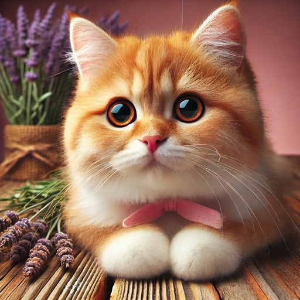
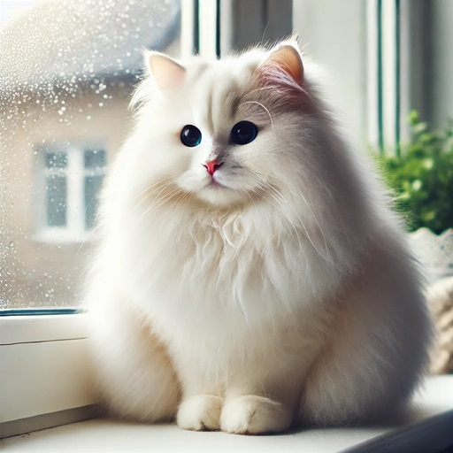

## Напиши запит для генератора зображень ШІ

Виконай ці кроки, щоб перетворити прості запити на докладні інструкції, які допоможуть тобі створювати дивовижні зображення.

--- task ---

**Почни з простого запиту**

Почни з основної ідеї. Це твоя відправна точка — що буде на зображенні.

Приклад: «кішка».

Введи цей запит у генераторі зображень. Подивися, що він зробив.

--- /task ---

--- task ---

**Додай конкретні деталі**

Подумай про деталі. Яка має бути ця кішка? Що вона має робити?

Приклад: «**пухнаста біла** кішка **сидить на підвіконні**».

Введи цей новий запит і порівняй результат із першим зображенням. Що змінилося?

--- /task ---

--- task ---

**Опиши задній план**

Де відбувається ця сцена? Коли ти додаєш опис оточення, ти даєш моделі більше корисної інформації про те, що має бути навколо головного елементу.

Приклад: «пухнаста біла кішка сидить на підвіконні **у затишній вітальні**».

Введи цей новий запит. Зверни увагу, що на зображенні зʼявилися нові предмети.

--- /task ---

--- task ---

**Додай основні елементи**

Які інші предмети мають бути на зображенні?

Приклад: «пухнаста біла кішка сидить на підвіконні у затишній вітальні **поруч з рослиною в горщику**».

Введи цей новий запит. Як додаткові деталі змінили зображення?

--- /task ---

--- task ---

**Вкажи конкретні кольори та стилі**

Кольори та стилі додають характеру вашому зображенню. Який настрій чи стиль ти хочеш отримати?

Приклад: «пухнаста біла кішка сидить на підвіконні у затишній **старомодній** вітальні поруч із **зеленою** рослиною в горщику».

Введи запит. Подивися, як кольори та стиль впливають на зображення.

--- /task ---

--- task ---

**Подумай про композицію**

Якою має бути композиція зображення? Це щось великим планом чи панорамне зображення?

Приклад: «**великий план** пухнастої білої кішки, яка сидить на підвіконні поруч із зеленою рослиною в горщику в затишній старомодній вітальні».

Запусти запит та подивися, як зміна композиції робить фокус зображення іншим.

--- /task ---

--- task ---

**Додай текст за бажанням**

Якщо ти хочеш, щоб на картинці був текст, опиши це в запиті та вкажи, як цей текст має виглядати.

Приклад: «великий план пухнастої білої кішки, яка сидить на підвіконні поруч із зеленою рослиною в горщику у затишній старомодній вітальні, а **внизу курсивний текст «рідна оселя»**.

Введи запит. Перевір, чи текст виглядає так, як задумано, і добре підходить до зображення.

--- /task ---

--- task ---

**Зміни та вдоскональ**

Протестуй свій запит у генераторі зображень. Якщо результат не ідеальний, підкоригуй деталі та спробуй знову. На попередніх зображеннях ми бачили, що котячі очі постійно різного кольору. Ти можеш це зараз виправити.

Приклад: «великий план пухнастої білої кішки **з блакитними очима**, яка сидить на підвіконні поруч із зеленою рослиною в горщику у затишній старомодній вітальні, а **внизу курсивний текст «рідна оселя»**.

Введи цей новий запит. Змінюй запит, якщо потрібно, доки зображення не відповідатиме твоїй ідеї.

--- /task ---

Молодець! Тепер ти вмієш перетворювати просту ідею на детальний запит для зображення. Продовжуй експериментувати та створюй власні унікальні зображення!
